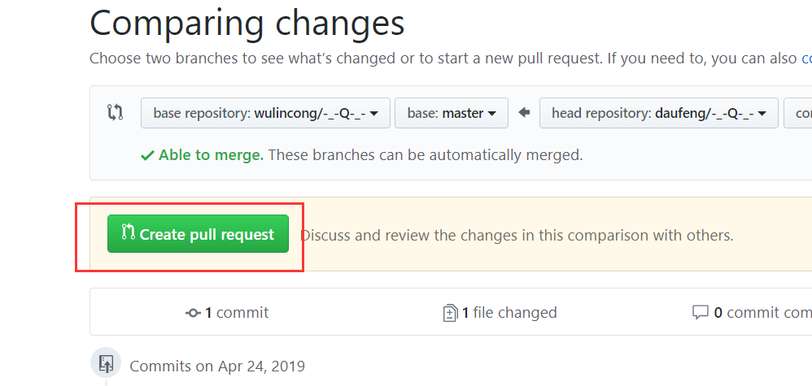
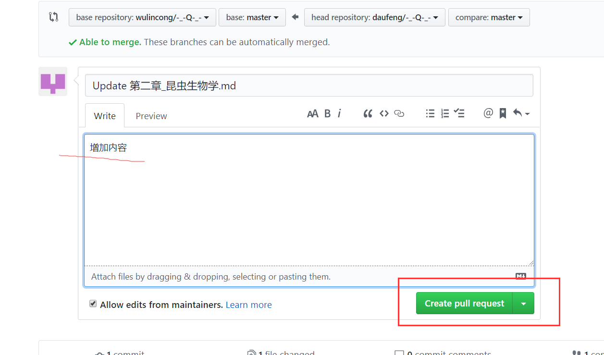

# -_-  
[blog pages](https://wulincong.github.io/-_-Q-_-/)
# [农业昆虫学—曲爱军](昆虫学/readme.md)

# [遗传学](遗传学/readme.md)

编写规则：  
#### 目录规则  

    第一级目录 输入#后面加一个空格，例如‘# 第一章’  
    第二级目录 ‘## 第一节’  
    第三级目录 ‘### 一、鞘翅目’  
    第N级目录  
    
#### 有序列表  

     小短线 或者叫减号 加空格 加内容 例如   
     ‘- 历史长  
     - 种类多’  
### 如何参与编写这个项目  
##### step1  
  
##### step2  
  
##### step3  
  
然后等我通过，就可以在[主页](https://wulincong.github.io/-_-Q-_-/)看到了  
